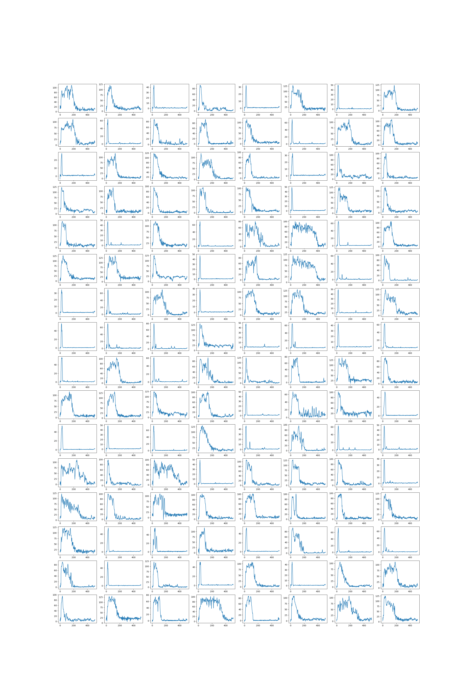
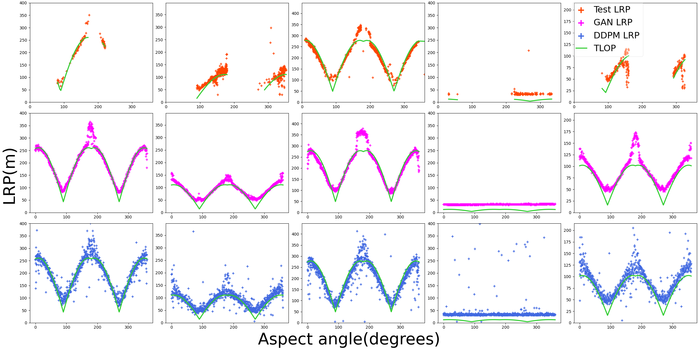

# HRRP Missing Scenarios — Conditional Generation (DDPM / GAN)

Code release for our EUSIPCO 2026 paper (to appear): **DDPM / GAN models for High-Resolution Range
Profile (HRRP) generation** and **missing aspect-angle scenario completion**.

- **Package:** `src/ship_hrrp_gen`
- **Configs:** `configs/`
- **Demo data:** `data/ship_hrrp.pt` (128 HRRPs, length 512)

<p align="center">
  
  <br/>
  <em>Figure 1 — Example HRRP samples from <code>data/ship_hrrp.pt</code>.</em>
</p>

---

## Overview

This repository focuses on **conditional** generative modeling for HRRPs. We study which acquisition
and target parameters must be provided to the generator in order to:
1. generate **ship-specific** HRRPs (not just “HRRP-looking” signals), and
2. **fill missing acquisition scenarios** (especially missing aspect angles) while preserving
   physically meaningful trends.

The provided training entrypoint supports both **GAN** and **DDPM** backends (depending on the chosen
YAML config).

---

## Key contributions (what to look for)

### 1) Fundamental conditioning variables

We show that **ship dimensions** (length *L*, width *W*) and **aspect angle** (*asp*) are *mandatory*
to generate ship-specific HRRPs. These conditions are **interdependent** (dimension effects cannot be
properly modeled without angle, and vice versa), which is reflected in the performance table below.

<p align="center">
  
  <br/>
  <em>Table 1 — Generation metrics for different models and conditioning types. Best scores per model are in bold.</em>
</p>

### 2) Generated HRRPs follow a geometric projection law (TLOP)

Although HRRPs are noisy and difficult to interpret at the signal level, the **apparent target extent**
along the range axis follows a simple geometric relationship with the **aspect angle**. We use the
**Theoretical Length of Object Projection (TLOP)** model:

\[
\mathrm{TLOP}(L, W, \mathrm{asp}) = |L\cos(\mathrm{asp})| + |W\sin(\mathrm{asp})|
\]

where:
- **L** = true ship length (meters),
- **W** = true ship width (meters),
- **asp** = aspect angle at acquisition time (radians).

From an HRRP, we estimate the **visual target length** by detecting occupied range bins. This yields a
measured quantity called **Length on Range Profile (LRP)**. In real data, LRP correlates well with the
TLOP curves.

Crucially, applying the same analysis to **generated HRRPs** shows that synthesized signals recover
**TLOP-consistent trends** and can **fill missing aspect-angle scenarios** (at a coarse scale). This
suggests the generator learns more than local realism: it preserves an underlying physical constraint
linked to line-of-sight projection geometry.

<p align="center">
  
  <br/>
  <em>Figure 2 — Correlation between measured/generated <i>LRP</i> and theoretical <i>TLOP</i> as a function of aspect angle.</em>
</p>

---

## Requirements

- Python ≥ 3.9
- PyTorch (CPU or CUDA)
- `data/ship_hrrp.pt` (demo dataset shipped with the repo)

---

## Installation
```bash
cd github_repo
python -m venv .venv
source .venv/bin/activate
pip install -r requirements.txt
pip install -e .   # installs the ship_hrrp_gen package from src/
```

## Run a training
```bash
python -m ship_hrrp_gen.train \
  --config configs/gan_scalars_serloss.yaml \
  --data data/ship_hrrp.pt \
  --seed 42 \
  --num-workers 0
```
Useful flags:
- `--num-workers`: dataloader workers (set 0 on small CPUs).
- `--skip-eval`: skip test metrics if no test split.
- `--fast-dev-run`: quick pipeline sanity-check (1 train/val/test batch).

## Quick sanity check
```bash
python -m ship_hrrp_gen.train \
  --config configs/gan_scalars_serloss.yaml \
  --data data/ship_hrrp.pt \
  --seed 0 \
  --num-workers 0 \
  --skip-eval \
  --fast-dev-run
```

Artifacts (checkpoints, figures, TensorBoard logs) are written under `results/` following the `figure_path` in the config.

## Layout
- `src/ship_hrrp_gen/`: models (DDPM, GAN), dataset, utils, training script (`train.py`).
- `configs/`: all YAML configs.
- `requirements.txt`: Python deps.
- `.gitignore`: ignores caches, venvs, and training outputs.

## Notes
- Intended for a quick demo run on the 128 generated samples; no multi-GPU setup required.
- Final metrics rely on `compute_metrics` in `ship_hrrp_gen.utils`. If there is no test split (`test_idx` empty), use `--skip-eval`.

## Citation 

```
@inproceedings{brient2026eusipco,
  author    = {Edwyn Brient and Santiago Velasco{-}Forero and Rami Kassab},
  title     = {{Conditional Generative Models for High-Resolution Range Profile: Capturing Global Trends in a Large-Scale Maritime Dataset}},
  booktitle = {Proc. European Signal Processing Conference (EUSIPCO)},
  year      = {2026},
  note      = {to appear}
}
```
